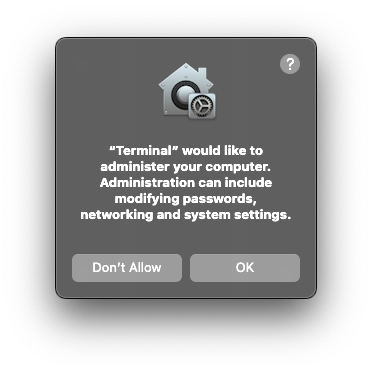

# Mac Muter
## Background
One of the problems with Do Not Disturb (DND) on a Mac is that it does not mute sound. It will still make a sound even you are in DND.(For example,Outlook Web App)
This will be very annoying if you are sleeping! So I created this script to mute sound regularly every day.

## Installation
Open Terminal on Mac, paste the following command: 
```bash
git clone https://github.com/yunpengeric/mac-muter.git && mv mac-muter ~/.mac-muter && ./.mac-muter/install.sh
```
Enter the time you want to mute sound. Make sure the time is in HH:MM & 24-hour format.
For example:
```bash
What time do you want to mute(HH:MM format | 24 hour system)?22:00
```


Click `OK` to continue.
You will see a message that says `Done! Your computer will be muted at 22:00 every day.`
